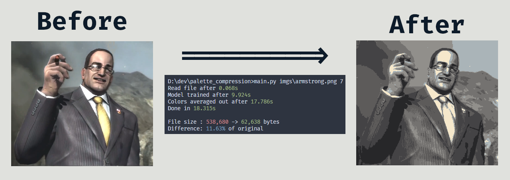
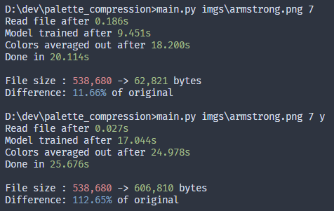

<h2>Palette Compression</h2>
<!-- <h6>fork by Calamity34, original by volyomaS</h6> -->

---
This script can compress the color palette of your image using ML algorithms (KMeans and DBSCAN).\
You can run this script from the console:\
`python main.py <filename> [colors=2] [use DBSCAN=N/y]`

For example:\
`python main.py armstrong.png 7`

<b>DBScan is broken</b>

> DBSCAN is currently broken. Images have artifacts, if you can fix it - PLEASE drop a PR.  
> Here's a comparison of timings, also look in the [`imgs/`](imgs/) folder to see the results:  
> 

More examples can be seen in **[samples.md](samples.md)**

<!-- Source:\
\
KMeans with 7 colors:\
 -->
