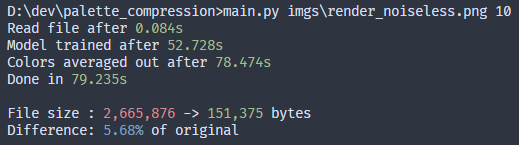
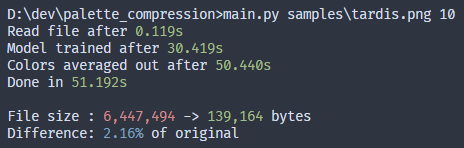

# Samples

This file contains examples of different files that the script worked on.

Presented in form of log-input-output.

<b>Warpfog</b>

>**Console:**
>
>
>
>**Input:**
>
>
>
>**Output:**
>
>

<b>Tardis</b>

>**Console:**
>
>
>
>**Input:**
>
>
>
>**Output:**
>
>

